# 实验一：OpenWrt 虚拟机搭建
## 实验目的：
- 熟悉基于OpenWrt的无线接入点（AP）配置
- 为第二章，第三章和第四章实验准备好“无线软AP”环境
## 实验环境
- 可以开启监听模式、AP 模式和数据帧注入功能的 USB 无线网卡
- Virtualbox
## 实验要求
- 对照第一章实验无线路由器/无线接入点（AP）配置列的功能清单，找到在OpenWrt中的配置界面并截图证明；
- 记录环境建设步骤；
- 如果USB无线网卡能在OpenWrt中正常工作，则截图证明；
- 如果USB无线网卡不能在OpenWrt中正常工作，截图并分析可能的故障原因并导致可能的解决方法。
## 实验结果
- 重置和恢复AP到出厂默认设置状态（不要点重置，点完之后想要完成后面的自检就只能重新再来装一遍）
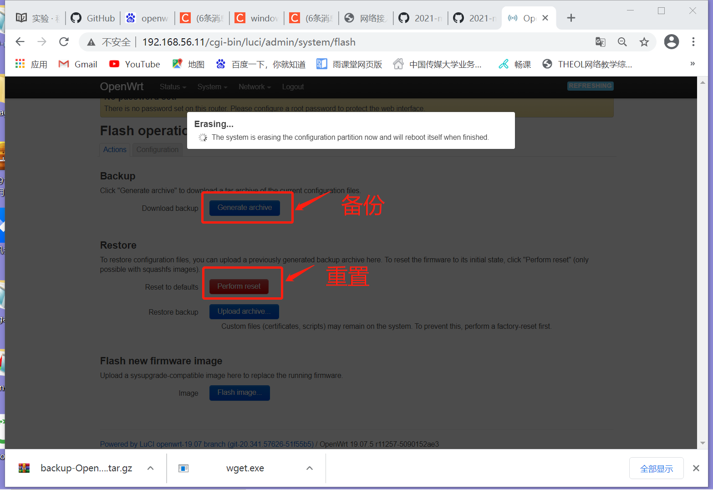
- 设置AP的管理员用户名和密码
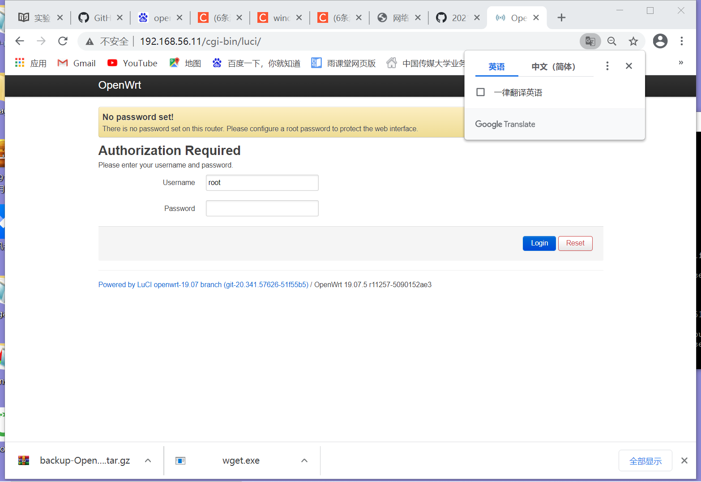
- 设置SSID广播和非广播模式
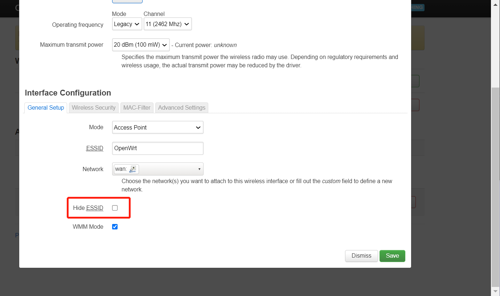
- 配置不同的加密方式
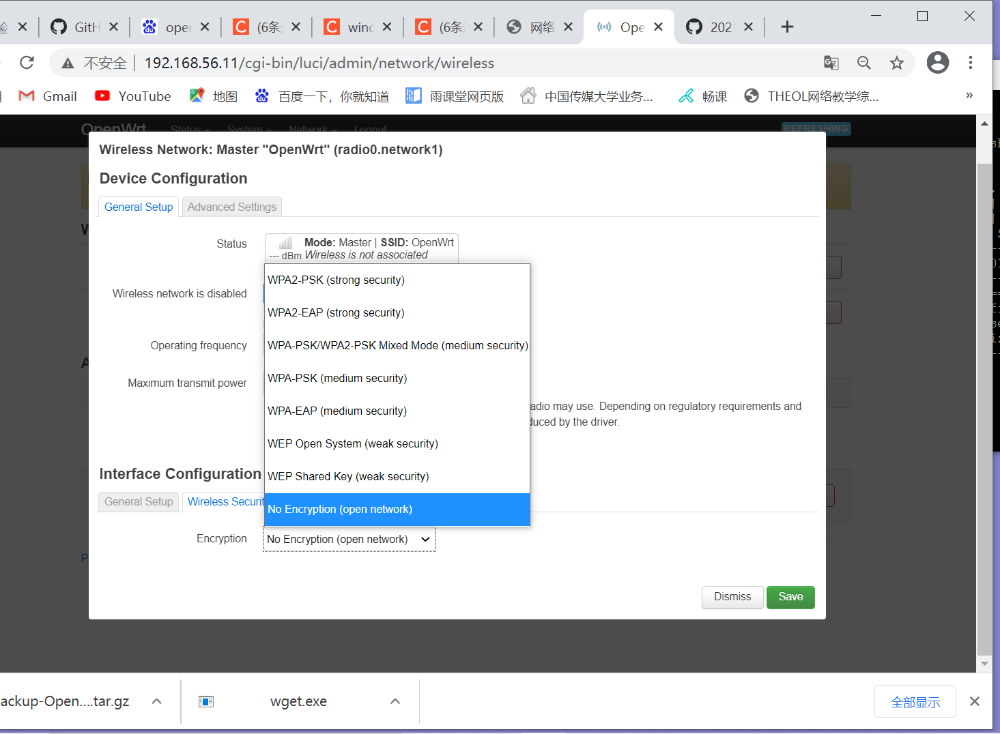
- 设置AP管理密码
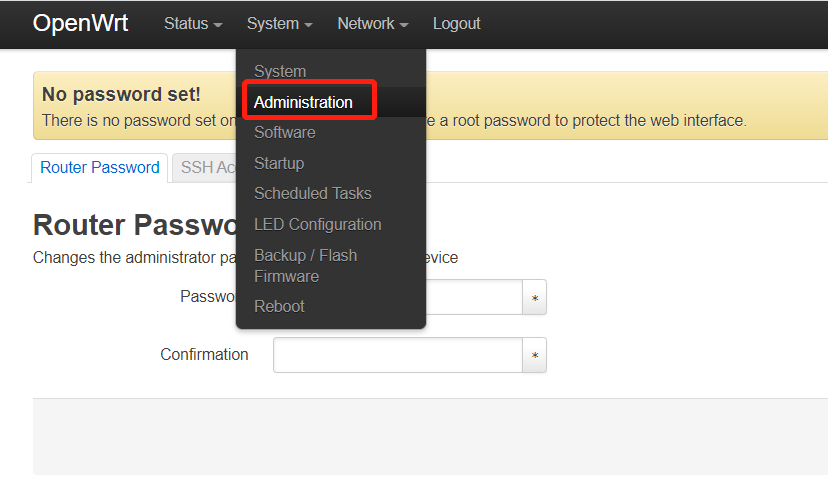
- 配置无线路由器使用自定义的DNS解析服务器
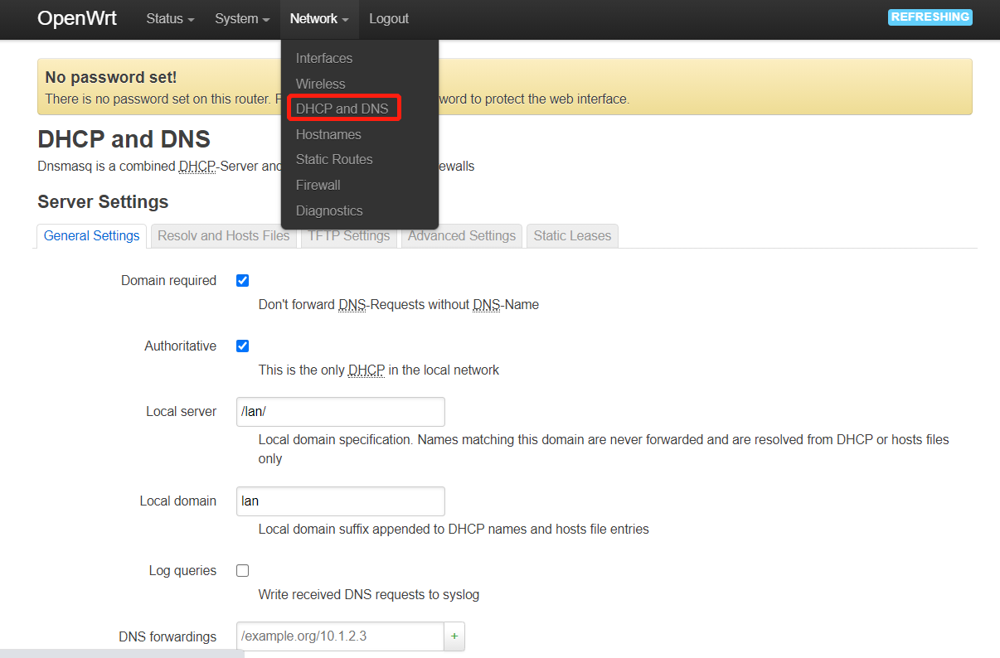
- 配置DHCP和禁用DHCP
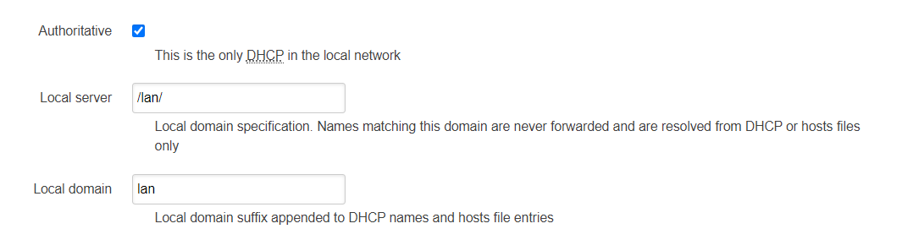
- 开启路由器/AP的日志记录功能（对指定事件记录）
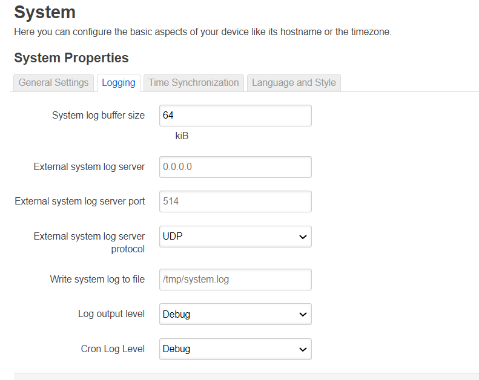
- 配置AP隔离(WLAN划分)功能
功能.png)
- 设置MAC地址过滤规则（ACL地址过滤器）
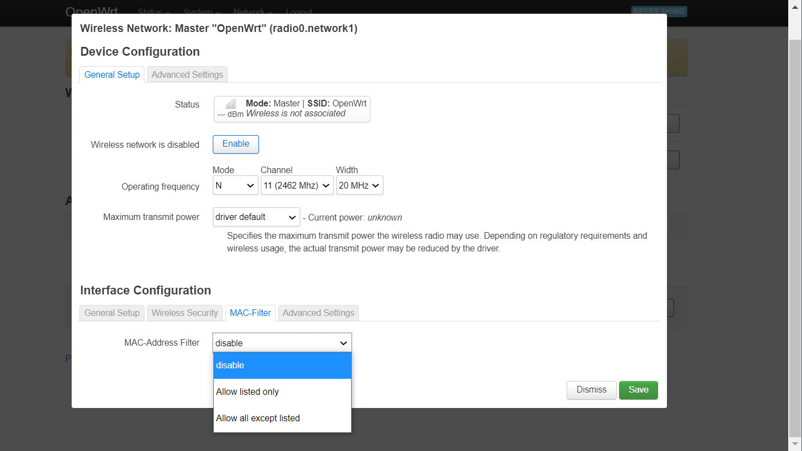
- 查看WPS功能的支持情况(未找到)
- 查看AP/无线路由器支持哪些工作模式
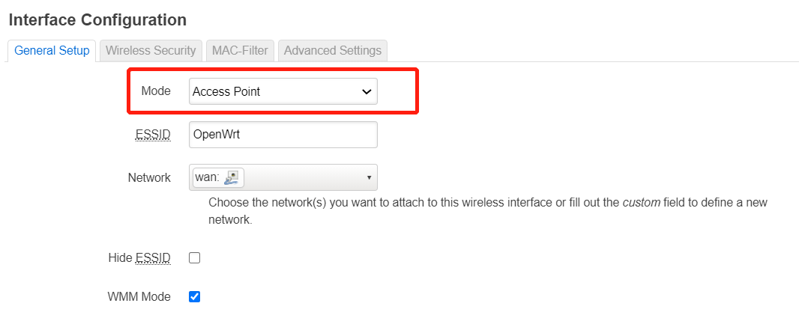

## 实验步骤
### 安装OpenWrt
- [下载wget](https://eternallybored.org/misc/wget/)，解压缩放到```C:\Program Files\Git\mingw64\bin```目录下
```
# 下载镜像文件
wget https://downloads.openwrt.org/releases/19.07.5/targets/x86/64/openwrt-19.07.5-x86-64-combined-squashfs.img.gz

# 解压缩
gunzip openwrt-x86-64-combined-squashfs.img.gz

# img 格式转换为 Virtualbox 虚拟硬盘格式 vdi
dd if=openwrt-19.07.5-x86-64-combined-squashfs.img of=openwrt-x86-64-combined-squashfs-padded.img bs=128000 conv=sync

"C:\Program Files\Oracle\VirtualBox\VBoxManage.exe" convertfromraw --format VDI openwrt-x86-64-combined-squashfs-padded.img openwrt-x86-64-combined-squashfs.vdi
# 新建虚拟机选择「类型」 Linux / 「版本」Linux 2.6 / 3.x / 4.x (64-bit)，填写有意义的虚拟机「名称」
# 内存设置为 256 MB
# 使用已有的虚拟硬盘文件 - 「注册」新虚拟硬盘文件选择刚才转换生成的 .vdi 文件
```
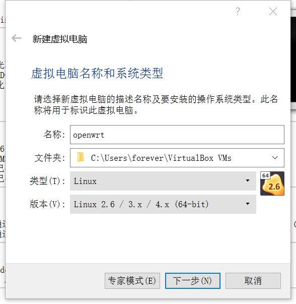
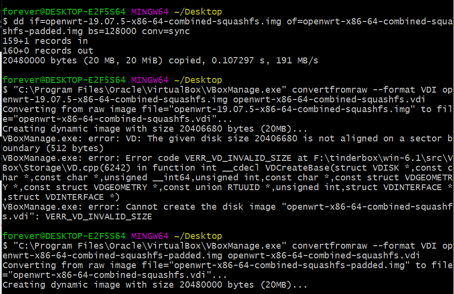
- 磁盘扩容
```
"C:\Program Files\Oracle\VirtualBox\VBoxManage.exe" modifymedium disk --resize 10240 openwrt-x86-64-combined-squashfs.vdi
```
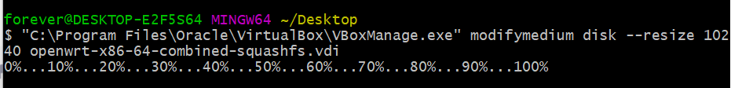
- 根据已有的vdi创建openwrt虚拟机，并设置网卡
> - 第一块网卡设置为：Intel PRO/1000 MT 桌面（仅主机(Host-Only)网络）
> - 第二块网卡设置为：Intel PRO/1000 MT 桌面（网络地址转换(NAT)）
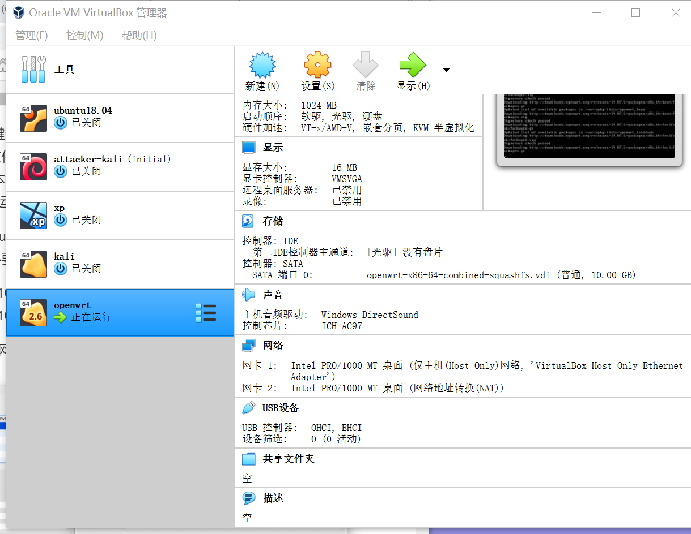
- 打开openwrt，使用```vi```命令直接编辑```/etc/config/network```配置文件修改网卡地址（秩序改option ipaddr中的地址即可）
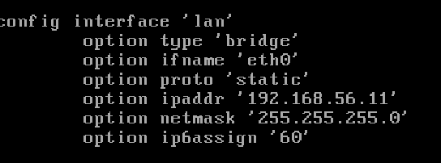
- 配置网络之后，可以通过```ifdown lan && ifup lan```完成eth0的重新加载配置生效
- Luci软件包安装
```
# 更新 opkg 本地缓存
opkg update

# 检索指定软件包
opkg find luci

# 查看 luci 依赖的软件包有哪些 
opkg depends luci

# 查看系统中已安装软件包
opkg list-installed

# 安装 luci
opkg install luci

# 查看 luci-mod-admin-full 在系统上释放的文件有哪些
opkg files luci-mod-admin-full
```
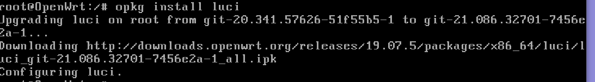
### 开启AP功能
```
# 每次重启OpenWRT之后，安装软件包或使用搜索命令之前均需要执行一次 opkg update
opkg update && opkg install usbutils

# 查看 USB 外设的标识信息
lsusb

# 查看 USB 外设的驱动加载情况
lsusb -t
```
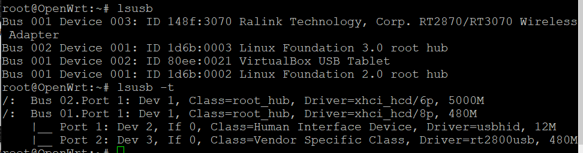
- 根据截图可以看见芯片```RT2870```的无线网卡还没有加载到匹配的驱动，通过```ifconfig -a``` 或者```ip link```可以验证系统当前只能识别到一块网卡
```
通过 opkg find 命令可以快速查找可能包含指定芯片名称的驱动程序包
opkg find kmod-* | grep 2870
```
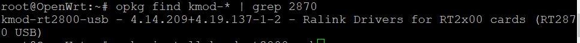
- 根据截图安装```kmod-rt2800-usb```驱动之后再执行```lsusb -t```就可以发现已经成功加载驱动了
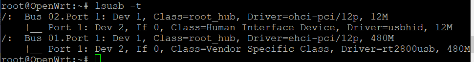
- 默认情况下，```OpenWrt``` 只支持 WEP 系列过时的无线安全机制。为了让 ```OpenWrt``` 支持 WPA 系列更安全的无线安全机制，还需要额外安装 2 个软件包：```wpa-supplicant``` 和 ```hostapd``` 。其中 ```wpa-supplicant``` 提供 WPA 客户端认证，```hostapd``` 提供 AP 或 ad-hoc 模式的 WPA 认证。安装软件包并重启虚拟机之后就可以看见```Luci```顶部菜单```network```里面新增了一个菜单项```wireless```
```
opkg install hostapd 
opkg install wpa-supplicant
```
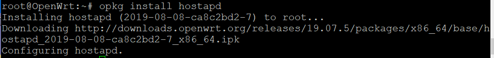
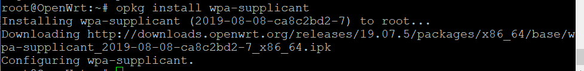
- 为了使用其他无线客户端可以正确发现新创建的无线网络，以下还有 3 点需要额外注意的特殊配置注意事项：
> - 无线网络的详细配置界面里的 Interface Configuration 表单里 Network 记得勾选 wan ；
> - 虚拟机的 WAN 网卡对应的虚拟网络类型必须设置为 NAT 而不能使用NatNetwork ，无线客户端连入无线网络后才可以正常上网。
> - 不要使用 Auto 模式的信道选择和信号强度，均手工指定 才可以。
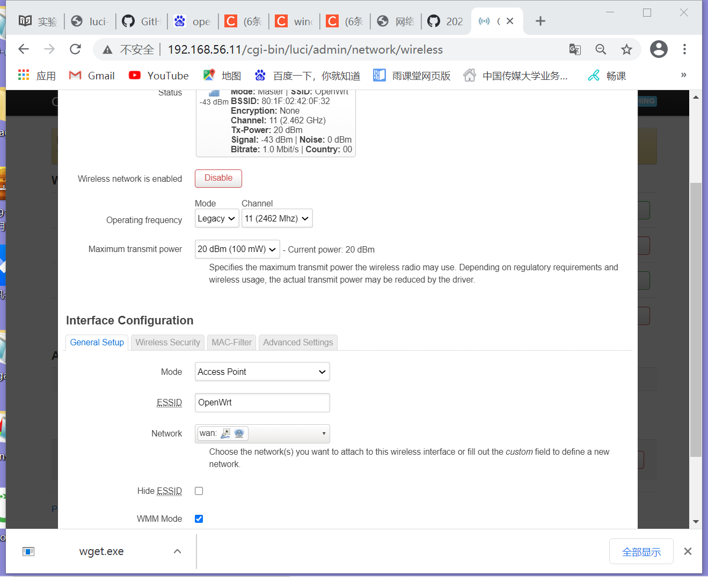
- 完成无线网络配置之后，需要点击 ```Enable``` 按钮启用当前无线网络。
- 当没有客户端加入当前无线网络时，我们在 ```LuCi``` 上查看无线网络状态如下图所示：
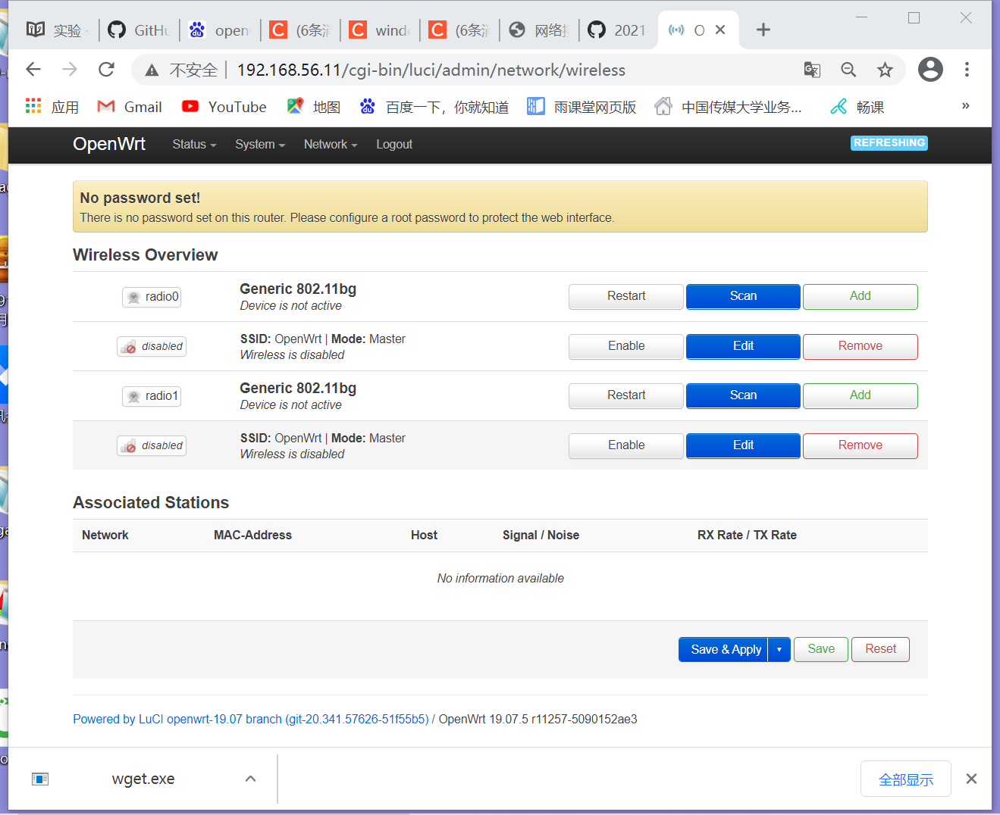
- 当有客户端加入当前无线网络时，我们在 ```LuCi``` 上查看无线网络状态如下图所示(红框中为我自己手机连接)：
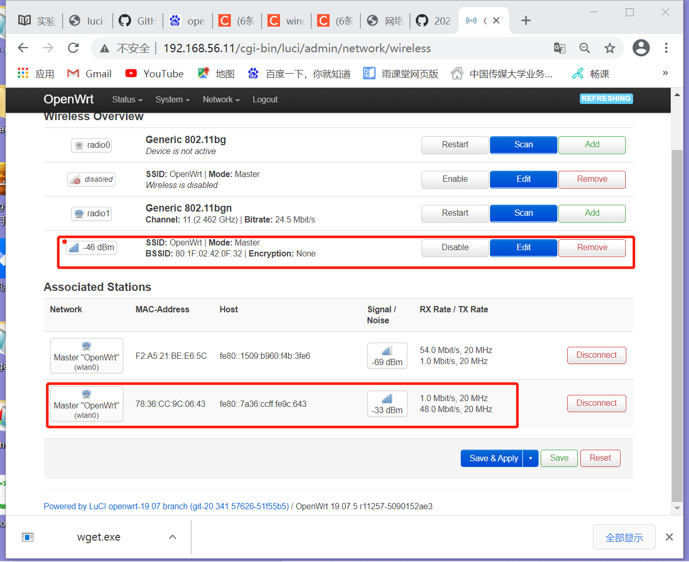
## 参考资料
[课本](https://c4pr1c3.github.io/cuc-mis/chap0x01/exp.html)

