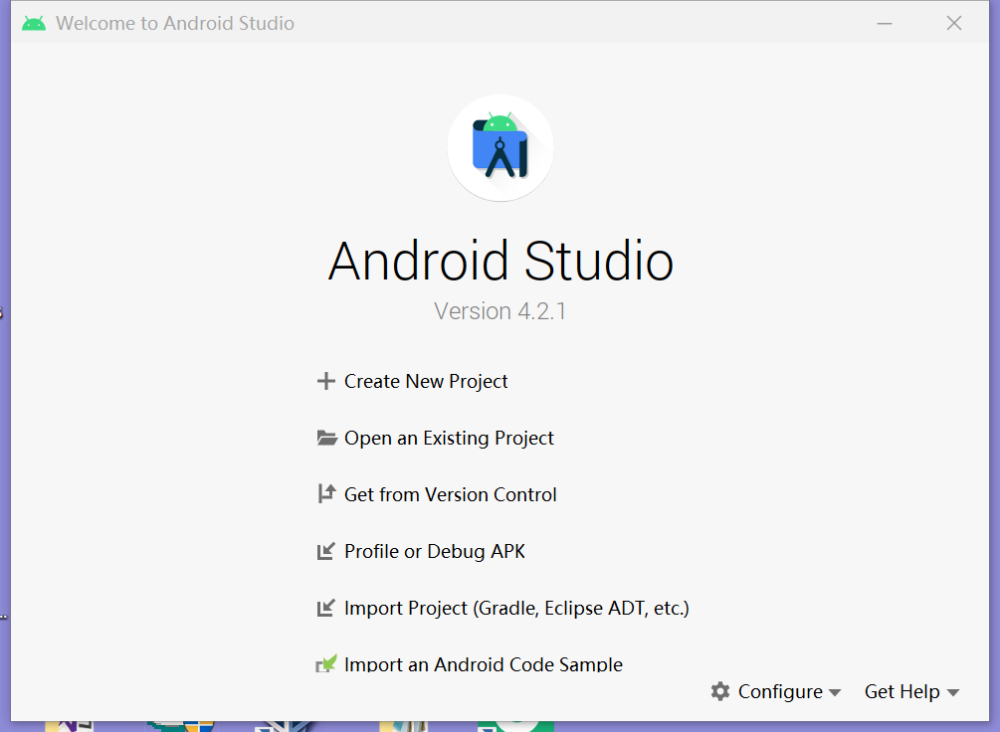

# Android Studio 模拟器环境搭建
## 实验要求
- [x] 安装和配置 Java SDK
- [x] 安装Android Studio
- [x] 下载安装 Android SDK
- [x] 配置 Android 模拟器运行环境
- [x] 配置 Gradle 编译环境

## 实验环境
- win10家庭版
- Android Studio

## 实验过程
### 安装和配置 Java SDK
- 由于以前安装过java，可以直接查看版本信息


- Android Studio 安装后已经内置了 Java 运行时环境，通过菜单 File -> Project Structure -> SDK Location 可以查看到 Android Studio 在编译当前项目时使用的 JDK 目录。


### 安装Android Studio
- [下载Android Studio](https://developer.android.google.cn/)
- 全部按照默认配置安装


- Android Studio首次启动，在默认路径下未找到Android SDK就会报下述错误。（但是我跳过这一步继续之后好像也没什么问题）




### 下载安装 Android SDK
- 打开``` Configure ```选项中的``` SDK manager ```里面的``` Android SDK ```选项发现``` Android SDK Location```处没有SDK地址，需要点击``` Edit ```进行编辑


- 编辑完后``` SDK Platforms``` 选项卡可以选择不同版本的 SDK 下载安装


### 配置 Android 模拟器运行环境
- 在 PC / Mac 上运行 Android 模拟器强烈建议必须安装 Intel x86 Emulator Accelerator (HAXM installer)，并且配合使用 ABI 类型为 x86/x86_64 的模拟器以获得最流畅的模拟器使用体验。


- 模拟器运行情况


### 配置 Gradle 编译环境
- 使用 Android Studio 的内置 gradle，插件版本信息：


## 实验中遇到的问题
- Android下载时总是出问题（如图），询问同学之后``` https://developer.android.google.cn/ ```利用这个网址成功下载


- ``` unable to access android sdk add-on list ```这个报错的时候，根据网上博客解决办法是：在Android Studio的安装目录下，找到```\bin\idea.properties```
在尾行添加```disable.android.first.run=true```表示初次启动不检测SDK,这个方法在我第一次下载Android Studio的时候尝试过了，但是后来因为报错太多解决太麻烦，我又卸载后重新下载了一次，第二次直接跳过没有修改似乎也没有出什么大问题。
- ``` the android sdk location cannot be at the filesystem root ```出现这个报错之后尝试了博客方法都无法解决所以我卸载重装了一次Android Studio

## 参考资料
- [黄老师课件](https://c4pr1c3.github.io/cuc-mis/chap0x05/exp.html#%E5%AE%89%E8%A3%85android-studio)
- [the android sdk location cannot be at the filesystem root.的解决方案](https://blog.csdn.net/zh0230826/article/details/112172092)
- [android studio运行时报错AVD Nexus_5X_API_P is already running解决办法](https://www.jianshu.com/p/140ad76764af)
- [Android Studio报错unable to access android sdk add-on list解决方案](https://blog.csdn.net/u010358168/article/details/81535307)