# ADB实验(安卓系统的访问控制策略与机制)

## 实验内容
- [x] 命令行
- [x] Activity Manager (am)
- [x] 软件包管理器 (pm)
- [x] 其他adb实验
- [x] Hello World v1
- [ ] Hello World v2

## 实验环境
- Android Studio
- Android 10（自己手机）
- Pixel 4 XL API 30

## 实验过程

### 命令行
- 为了简化命令行，将adb加到环境变量中
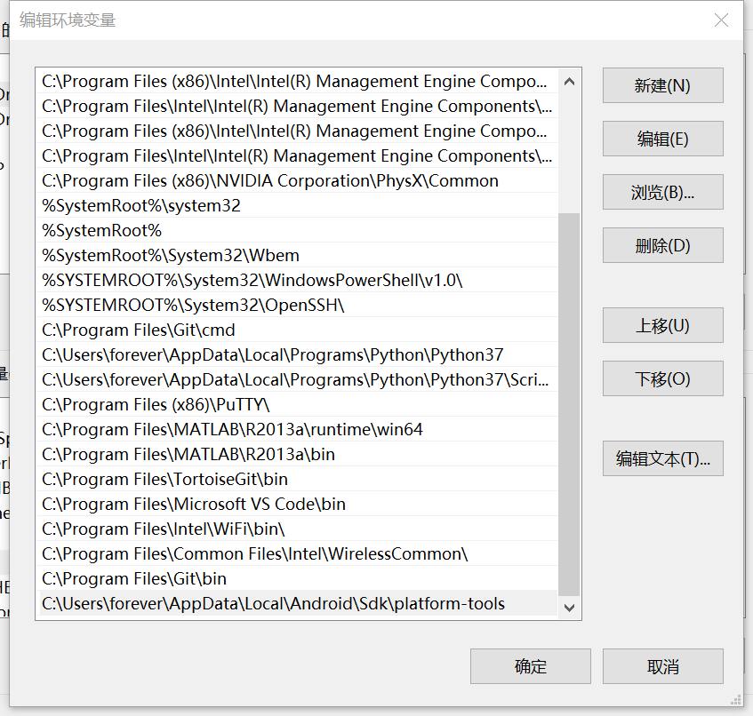

```
# 查看开启的模拟器
adb devices

# 连接模拟器终端
adb -s emulator-5554 shell

# 输出环境变量
echo $PATH

# 查看系统版本
uname -a

# 查看当前目录下文件
ls

# 进入文件夹
cd 
```
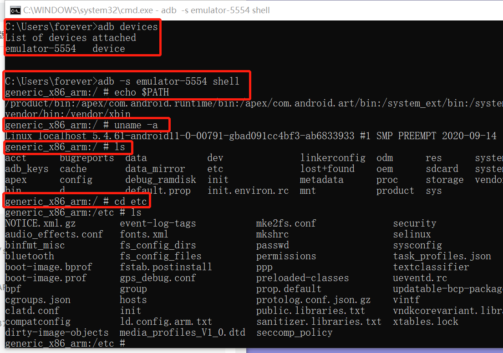

- ```adb pull remote local```将文件从设备复制到本地

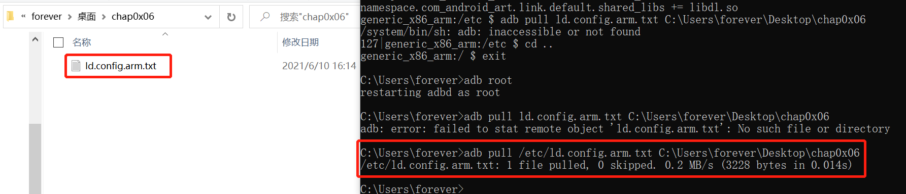

- ```adb push local remote```将文件从本地复制到设备

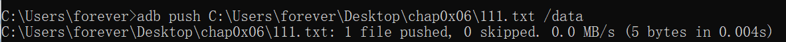

- ```adb install path_to_apk```安装应用

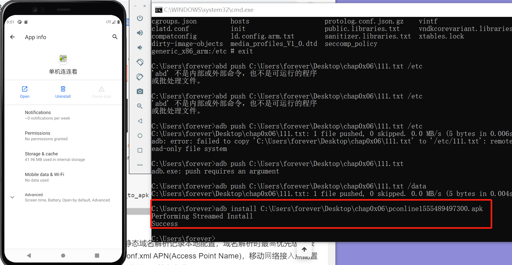

### Activity Manager (am)
```
# Camera（照相机）的启动方法为:
am start -n com.android.camera/com.android.camera.Camera

# Browser（浏览器）的启动方法为：
am start -n com.android.browser/com.android.browser.BrowserActivity

# 启动浏览器 :
am start -a android.intent.action.VIEW -d  http://sec.cuc.edu.cn/

# 拨打电话 :
am start -a android.intent.action.CALL -d tel:10086

# 发短信：
adb shell am start -a android.intent.action.SENDTO -d sms:10086 --es sms_body ye --ez exit_on_sent true
```
- 照相机和浏览器在某些版本系统中不支持am启动命令，因此，实验图只运行了最后三个命令


### 下载包
- ```adb install path_to_apk```


### 软件包管理器 (pm)
- ```pm list packages -3```查看第三方软件包
- ```adb shell pm uninstall com.example.MyApp```卸载包


### 其他adb实验
```
# 常用的按键对应的KEY_CODE
adb shell input keyevent 22 //焦点去到发送键
adb shell input keyevent 66 //回车按下

adb shell input keyevent 4 // 物理返回键
adb shell input keyevent 3 // 物理HOME键

# android 4.0+
$ input
usage: input ...
       input text <string>
       input keyevent <key code number or name>
       input tap <x> <y>
       input swipe <x1> <y1> <x2> <y2>
```
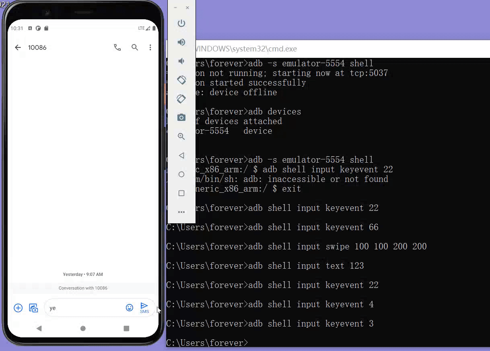


### Hello World v1
- 按照[官网创建Android项目](https://developer.android.google.cn/training/basics/firstapp/creating-project)进行项目创建
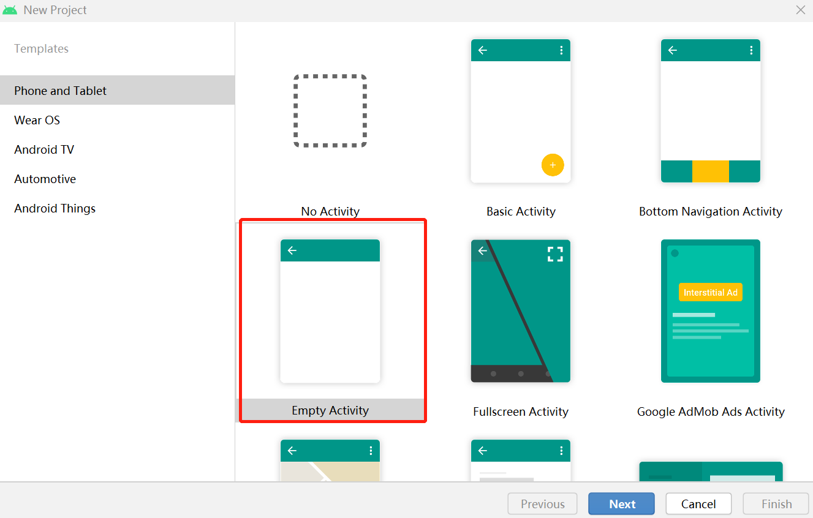

- Application Name：MISDemo
- Company Domain：cuc.edu.cn
- Language: Java

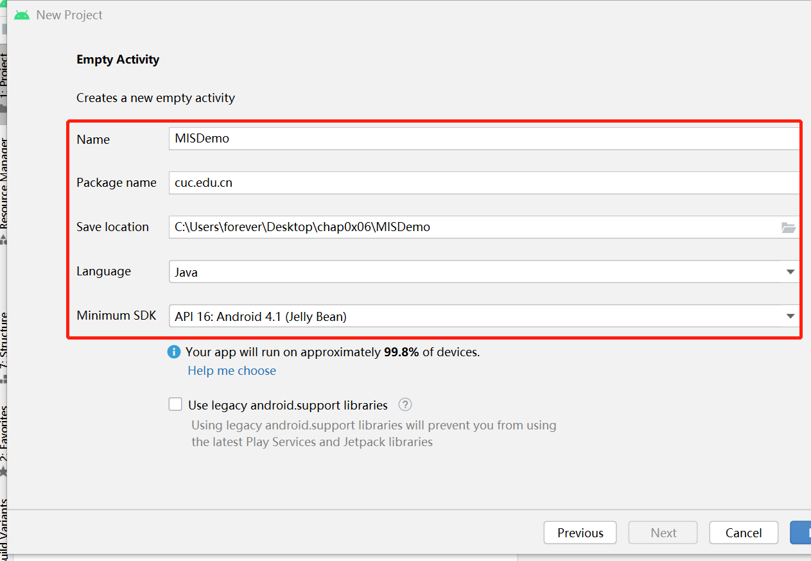

- 启动设备模拟器

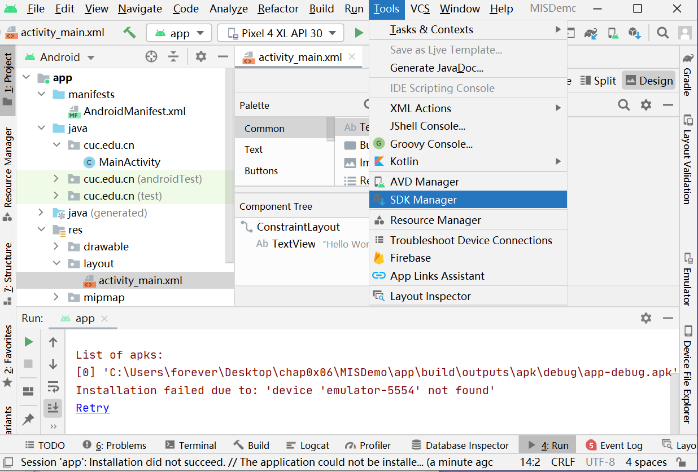

- 直接build项目

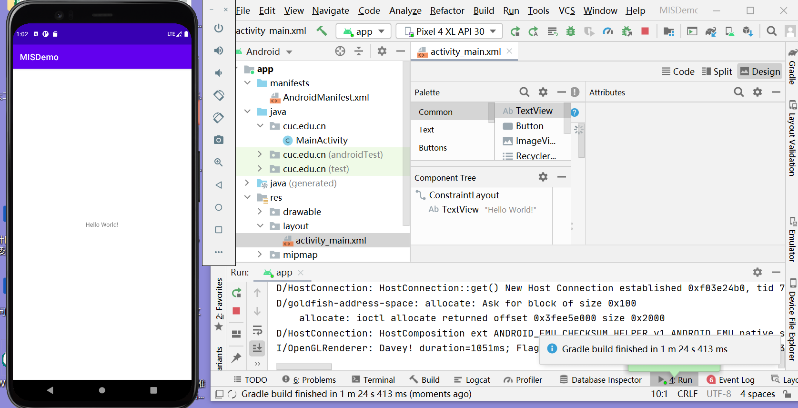

- Hello World v1实验结果
  
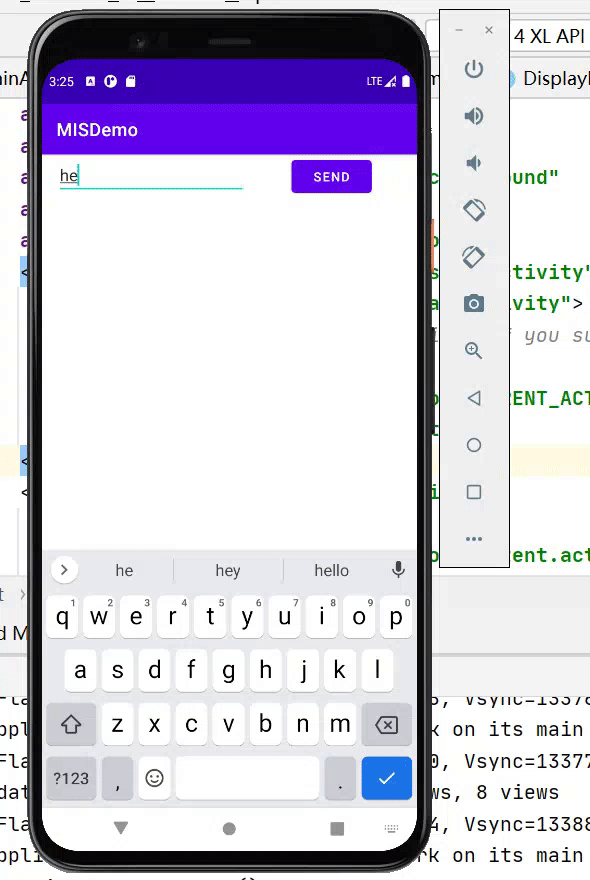

## 在代码编写和运行过程中，请特别关注以下问题：
- [x] 按照向导创建的工程在模拟器里运行成功的前提下，生成的APK文件在哪儿保存的？
``` C:\Users\forever\Desktop\chap0x06\MISDemo\app\build\outputs\apk\debug\app-debug.apk ```

- [x] 使用adb shell是否可以绕过MainActivity页面直接“唤起”第二个DisplayMessageActivity页面？是否可以在直接唤起的这个DisplayMessageActivity页面上显示自定义的一段文字，比如：你好移动互联网安全
    - 直接唤起页面前需要更改部分代码，使之可以跳过send环节直接输出自定义文字
    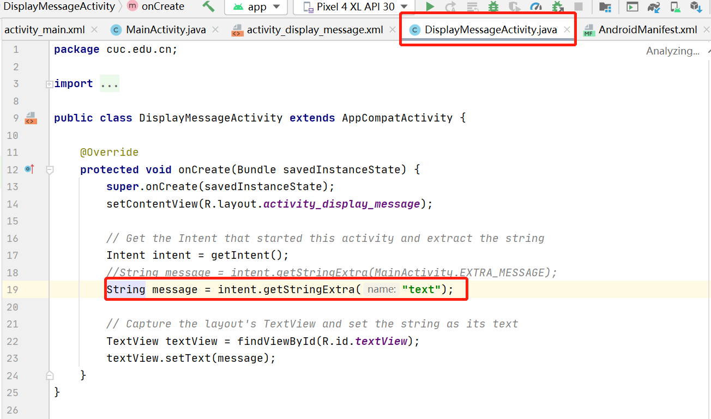
    - ```adb shell am start -n cuc.edu.cn/.DisplayMessageActivity -e "text" "你好移动互联网安全"```直接在命令行输入命令即可实现
    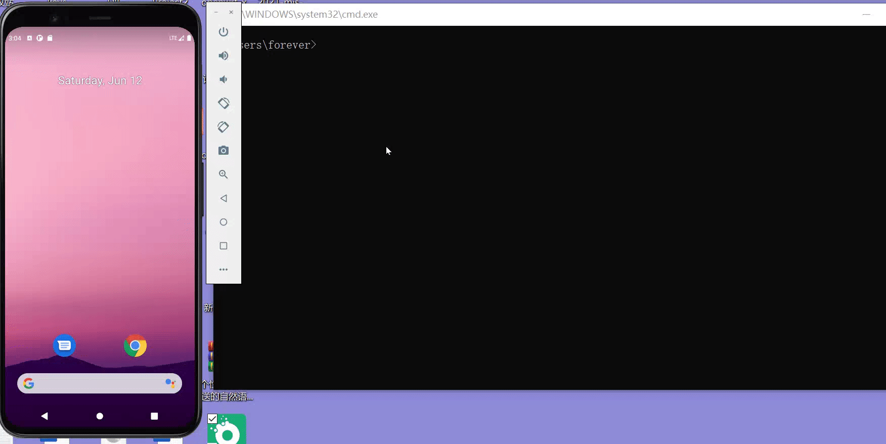

- [x] 如何实现在真机上运行你开发的这个Hello World程序？
    - 首先需要在Android Studio上连接到自己的手机
    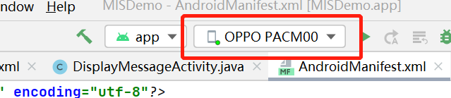
    - 直接运行程序
    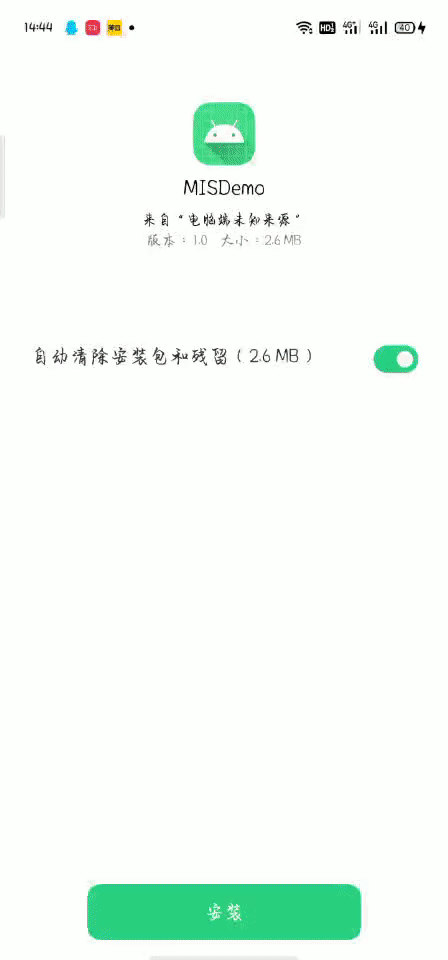
    

- [x] 如何修改代码实现通过 adb shell am start -a android.intent.action.VIEW -d http://sec.cuc.edu.cn/ 可以让我们的cuc.edu.cn.misdemo程序出现在“用于打开浏览器的应用程序选择列表”？
    - 在```AndroidManifest,xml```配置文件中的.```MainActivity```模块的子模块``` intent-filter ```中添加如下内容,实验结果图中没有显示是因为没有网
    ```
    <action android:name="android.intent.action.VIEW" />
       <category android:name="android.intent.category.DEFAULT" />
       <category android:name="android.intent.category.BROWSABLE" />
       <data android:scheme="http" />
       <data android:scheme="https" />
    ```
    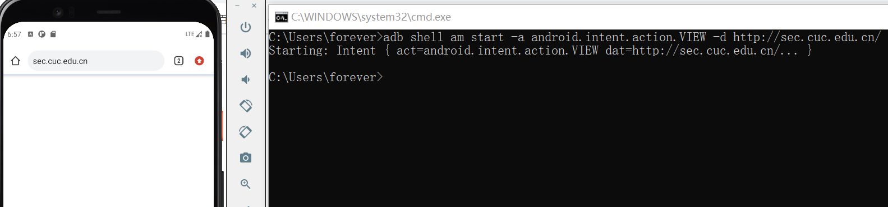
- [x] 如何修改应用程序默认图标？
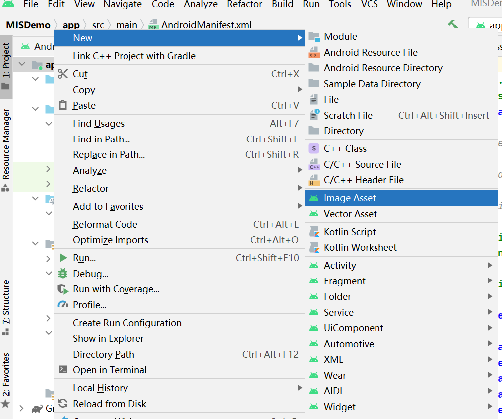
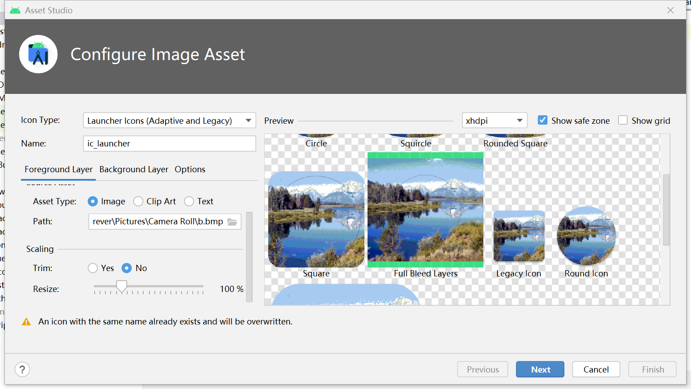
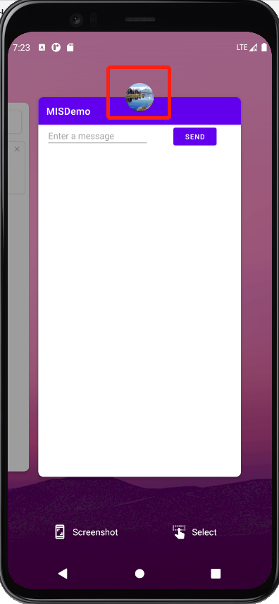

- [x] 如何修改代码使得应用程序图标在手机主屏幕上实现隐藏？
    - 在```AndroidManifest.xml```配置文件的```MainActivity```模块的子模块``` intent-filter ```中将```<category android:name="android.intent.category.LAUNCHER" />```改为 ```<category android:name="android.intent.category.LEANBACK_LAUNCHER"/>```
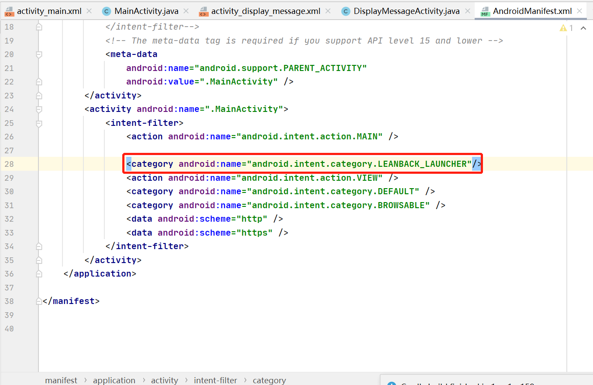
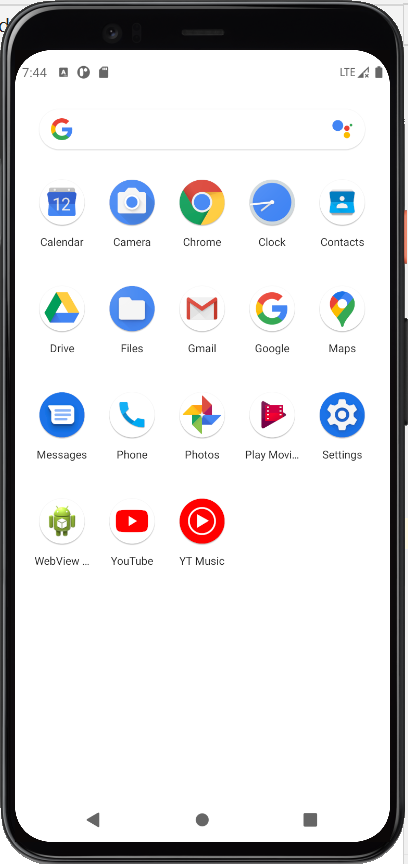

## 实验中遇到的问题及解决
- 手机连接不到Android Studio，打开```Android studio ——>tools——>sdk manager——>sdk tools```选择```Google usb driver```,打开```Android studio ——>tools——>sdk manager——>sdk platforms```选择你安卓手机的安卓系统版本后点击```apply```进行下载，并配置手机驱动程序，进入开发者模式之后方可解决，具体操作见参考资料
- 绕过MainActivity页面直接“唤起”实验中，会有```EditText editText = (EditText) findViewById(R.id.editText)```报错，询问同学并且查阅资料之后注释了```DisplayMessageActivity```的父类信息，并修改了字符串的输入方式。

## 参考资料
- [EditText editText = (EditText) findViewById(R.id.editText)报错解决](https://blog.csdn.net/Cybers/article/details/108731052)
- [adb启动程序命令](https://blog.csdn.net/xiezechang/article/details/8528446)
- [Android studio 如何连接手机](https://blog.csdn.net/hasfhaiogheiohf/article/details/104858071)
- [黄老师课件](https://c4pr1c3.github.io/cuc-mis/chap0x06/exp.html)
- [Android官网](https://developer.android.google.cn/training/basics/firstapp/creating-project)