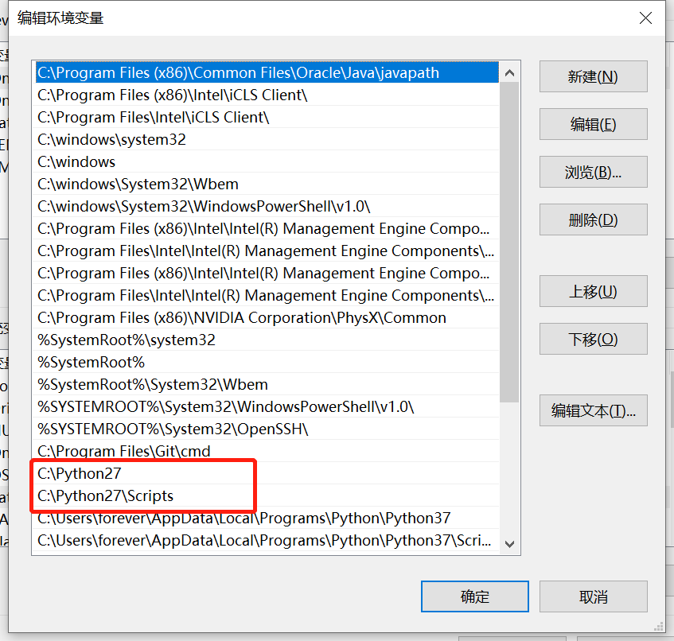
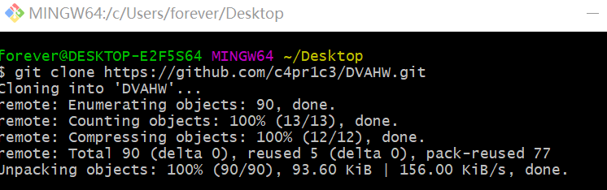
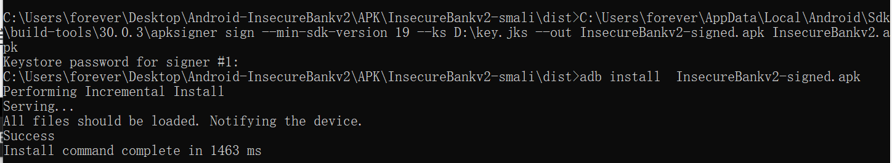

# Android 缺陷应用漏洞攻击实验

## 实验目的
- 理解 Android 经典的组件安全和数据安全相关代码缺陷原理和漏洞利用方法；
- 掌握 Android 模拟器运行环境搭建和 ADB 使用

## 实验环境
- [Android-InsecureBankv2](https://github.com/c4pr1c3/Android-InsecureBankv2)
- Python 2.7.18 
- Android Studio
- apktool 2.5.0

## 实验要求
- [x] 详细记录实验环境搭建过程；
- [x] 至少完成以下实验：
    - [x] Developer Backdoor
    - [x] Insecure Logging
    - [x] Android Application patching + Weak Auth
    - [x] Exploiting Android Broadcast Receivers
    - [x]Exploiting Android Content Provider
- [ ] （可选）使用不同于Walkthroughs中提供的工具或方法达到相同的漏洞利用攻击效果；
    - 推荐 drozer

## 实验过程
### 实验环境搭建
- 下载```Android-InsecureBankv2```仓库


- 下载[python 2.7](https://www.python.org/downloads/release/python-2718/)，并添加环境变量（我之前安装过```python 3.7```，所以需要移动到```python 3.7```的上面，让命令行默认运行```2.7```版本的）




- 安装```requirements.txt```中相关的包:```pip install -r requirements.txt```

- 启动服务器
```
cd AndroLabServer
python app.py
```


- 安装```InsecureBankv2.apk```（确保avd已经启动）
```
adb install InsecureBankv2.apk
```


- 安装成功后，使用以下用户名密码测试登录
```
User: dinesh 
Password: Dinesh@123$ 
User: jack 
Password: Jack@123$
```

登录成功后会有如上显示

## Developer Backdoor
- 安装```Android-InsecureBankv2 apk```（已完成）
- 安装```JADX```
```
git clone https://github.com/skylot/jadx.git
cd jadx
./gradlew.bat dist
```


- 下载[dex2jar](https://sourceforge.net/projects/dex2jar/files/dex2jar-2.0.zip/download)并解压缩
```
mkdir APK
mv InsecureBankv2.apk APK/InsecureBankv2.apk
cd APK/
unzip InsecureBankv2.apk
```


- 将classes.dex文件复制到dex2jar目录下


- 将```.dex```文件转换为```.jar```文件:
``` 
./d2j-dex2jar.bat classes.dex
```
  


- 进入目录```C:\Users\forever\Desktop\jadx\build\jadx\bin```,找到```jadx-gui.bat```双击打开，选择```classes-dex2jar.jar```文件

- 下面的屏幕截图显示了```Android-unsecurebankv2```应用程序中存在的开发人员后门的反编译代码，该应用程序允许用户名为```“devadmin”```的用户到达与所有其他用户不同的端点。


- 结果发现，任何用户都可以使用帐户用户名“devadmin”并使用任何密码登录到应用程序，而不考虑密码的有效性。


## Insecure Logging
- 安装```Android-InsecureBankv2 apk```（已完成）
- 安装```Android SDK```（已完成）
- 将```InsecureBankv2.apk```文件复制到```C:\Users\forever\AppData\Local\Android\Sdk\platform-tools ```文件夹中，然后使用```adb install InsecureBankv2.apk```进行安装
- ``` adb logcat```查看日志，利用图片中的命令将日志打印到txt文件中方便查看

- 在模拟器上启动```InsecureBankv2```，并输入测试登录的用户名及密码进行登录并修改密码


- 日志中成功登录的记录


- 日志中成功修改密码的记录


## Android Application patching + Weak Auth
- 安装```Android-InsecureBankv2 apk```（已完成）
- 安装```Android SDK```（已完成）
- 安装[apktool](https://ibotpeaches.github.io/Apktool/install/),下载```.bat```和```.jar```文件并放到c盘windows目录下（可不添加环境变量直接使用命令）
- 安装```SignApk ```
```
git clone https://github.com/appium-boneyard/sign.git
```
- 但是直接安装有些命令不能用，所以需要进行签名
    - 下载[DVAHM](https://github.com/c4pr1c3/DVAHW),并在Android Studio中导入项目

    

    - ```Build```-```Generate Signed Bundle or APK```-选择```APK```-（如果没有创建密钥库，先要```CreateNewKeyStore```），创建密钥之后生成发布版```apk```文件
    
    

    
- 在``` C:\Users\forever\Desktop\Android-InsecureBankv2\APK```目录下进行反汇编
```
apktool d InsecureBankv2.apk -o InsecureBankv2-smali
```


- 在```C:\Users\forever\Desktop\Android-InsecureBankv2\APK\InsecureBankv2-smali\res\values```目录下找到``` String.xml```进行编辑


- 回到``` C:\Users\forever\Desktop\Android-InsecureBankv2\APK```目录下重新编译
```
apktool b InsecureBankv2-smali
```


- 对新生成的apk文件签名
```
cd InsecureBankv2-smali\dist
C:\Users\forever\AppData\Local\Android\Sdk\build-tools\30.0.3\apksigner sign --min-sdk-version 19 --ks D:\key.jks --out InsecureBankv2-signed.apk InsecureBankv2.apk
```


- 先卸载之前的```InsecureBankv2```应用程序，再安装```InsecureBankv2-signed.apk```
```
adb install  InsecureBankv2-signed.apk
```



- 在模拟器中启动新安装的InsecureBankv2，发现界面多了一个额外的Create user按钮


- 尝试点击Create user按钮创建新用户，但并没有创建，这是假的创建用户按钮，并没有实现功能。

## Exploiting Android Broadcast Receivers
- 安装```Android-InsecureBankv2 apk```（已完成）
- 安装```Android SDK```（已完成）
- 安装```apktool```（已完成）
- 安装```JADX```（已完成）
- 安装```dex2jar```（已完成）
- 打开解密的```AndroidManifest.xml```文件


- 下面的屏幕截图显示了传递给前面显示的应用程序中声明的```Broadcast Receiver```的参数


- 在命令行中打开```adb shell```
- 输入下面的命令（绕过登录直接修改密码）
```
am broadcast -a theBroadcast -n com.android.insecurebankv2/com.android.insecurebankv2.MyBroadCastReceiver --es phonenumber 5554 --es newpass Dinesh@123!
```


- 回到模拟器中，打开Messages应用，发现上述输入的命令自动发送短信联系上述广播接收器，并发送带有密码的短信文本


## Exploiting Android Content Provider
- 安装```Android-InsecureBankv2 apk```（已完成）
- 安装```Android SDK```（已完成）
- 安装```apktool```（已完成）
- 安装```JADX```（已完成）
- 安装```dex2jar```（已完成）
- 打开```AndroidMainfest.xml```文件，找到```TrackUserContentProvider```


- 在反编译文件中发现，传过来的数据会被保存到设备的sql数据库中：


- 打开命令行输入```adb shell```进入adb命令行再输入下命令
```
content query --uri content://com.android.insecurebankv2.TrackUserContentProvider/trackerusers

```


- 发现登录记录以明文的方式记录在设备上

## 实验中遇到的问题
- 使用```jadx-gui.bat```时打不开```jar```文件并产生了log文件，这是因为，打开的程序太多了，关掉几个就好了


- 安装apk时碰到```INSTALL_FAILED_UPDATE_INCOMPATIBLE```问题,因为前两个实验下载的```InsecureBankv2```应用程序没有卸载，所以不能进行安装，卸载之后就能正常安装了

- jadx运行出错，找不到jar文件。重新下载了一个jdk文件并加到了环境变量中


## 参考资料
- [INSTALL_FAILED_UPDATE_INCOMPATIBLE](https://bbs.csdn.net/topics/350116797)
- [黄老师b站视频](https://www.bilibili.com/video/BV1rr4y1A7nz?from=search&seid=6142859782746666446)